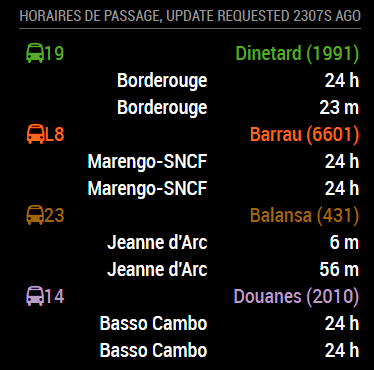

# MMM-Toulouse-Transports


Attempt to make a Magic Mirror Module for Toulouse transportation system.
I'm new to Git, MMM, Javascript/Node, so this also a Sandbox for me.

The module depends exclusively on the [TISSEO web API](https://data.toulouse-metropole.fr/explore/dataset/api-temps-reel-tisseo/) and [Tisseo/Toulouse Open Data](https://data.toulouse-metropole.fr/explore/dataset/tisseo-gtfs/).
Documentation was found [here (Open Data link)](https://data.toulouse-metropole.fr/explore/dataset/api-temps-reel-tisseo/table/)
You'll need to ask them for an API key to use this module here : `opendata@tisseo.fr`. There might be some restrictions if you overuse it.

I'm thinking about makin the displays more minimalistic, but for now, I need to focus on Javascript/DOM syntax and mechanics.

## WARNING: License and intellectual property statement

Heavily inspired from [da4throux's project](https://github.com/da4throux/MMM-Paris-RATP-PG)

No license defined yet, this should probably inherit da4throux's project license.
working on it for now.

However, due to the API being slightly different, many adaptation were made.

# Screenshot


# Install

First, make sure you have MagicMirror installed. Go into the MagicMirror Folder.


1. Clone repository into `../modules/` inside your MagicMirror folder.
	```
	cd ./modules/
	git clone https://github.com/LoneWanderer-GH/MMM-Toulouse-Transports
	```

2. Run `npm install` inside `../modules/MMM-Toulouse-Transports/` folder
	```
	cd ./MMM-Toulouse-Transports/ && npm install
	```

You can do steps 1 and 2 in one single command:

	```
	cd ~/MagicMirror/modules/ && git clone https://github.com/LoneWanderer-GH/MMM-Toulouse-Transports && cd ~/MagicMirror/modules/MMM-Toulouse-Transports/ && npm install
	```


Now you can add the module to the MagicMirror config. See following paragraph.

## Configuration
Add the MMM-Toulouse-Transports config parameters to the Magic Mirror config file.
Example:
```
{
    module: "MMM-Toulouse-Transports",
    position: "top_right",
    header: "Horaires de passage",
    config:
    {
        apiKey: "YOUR API KEY HERE",
	debug: true,             // if you have issues and want to help me fix them, yo should put this to true
        updateInterval: 60000,   // refresh frequency in ms
        stopSchedules: [
        {
            lineNumber: 19, // bus line number (the one displayed on bus stops, maps and buses ..). Can be a string or a number (e.g.: L1,L2 ... L8, 13,54 ...)
            stopCode: 1991, // this is an exact stop code of Tisseo. You can find it on your favorite bus stop sign. or Get it on Tisseo travels webapp
            maxEntries: 2   // if you want the 2 next buses schedules
        },
        {
            lineNumber: "L8",
            stopCode: 6601,
            maxEntries: 2
        },
        {
            lineNumber: 23,
            stopCode: 431,
            maxEntries: 2
        },
        {
            lineNumber: 14,
            stopCode: 2010,
            maxEntries: 2
        }]
    }
}
```
